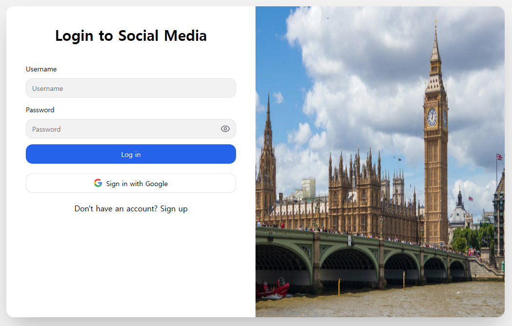
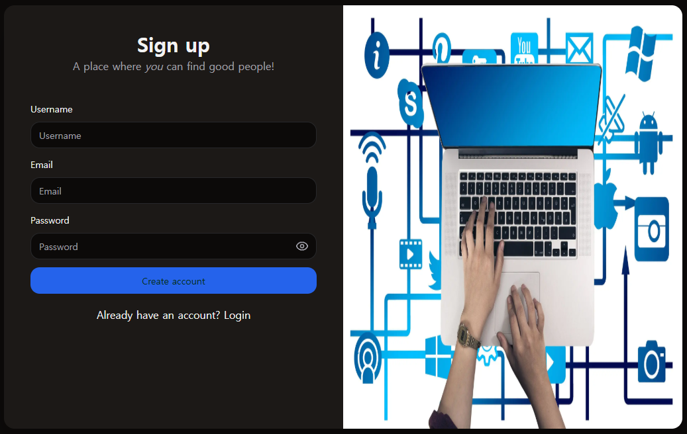
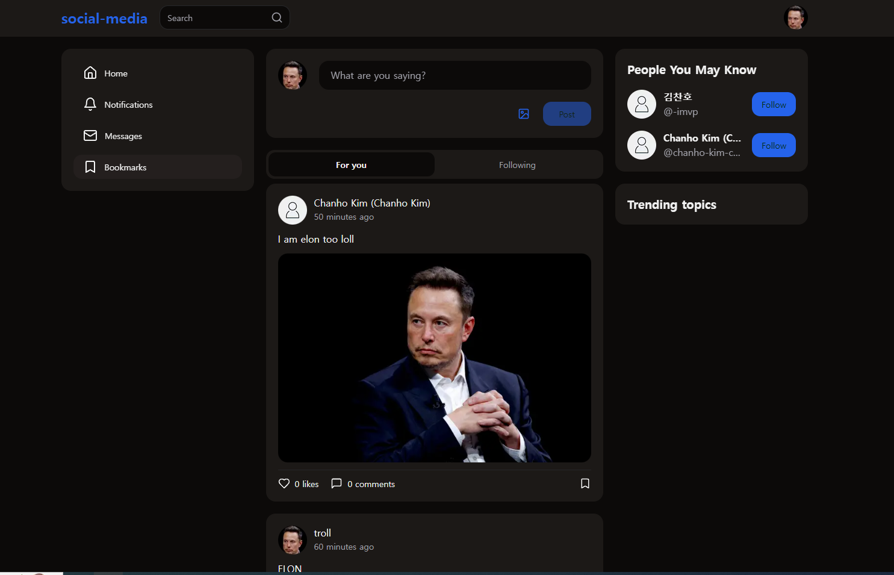

# 🌐 Social Media App 프로젝트

<p align="center">
  
  <br/>
  
  <br/>
  
</p>

---

## 프로젝트 개요
**Social Media App**은 React, Next.js, Node.js, Express, MongoDB, Clerk 등 최신 기술 스택을 활용한 **풀스택 SNS 웹앱**입니다.  
회원가입/로그인, 게시물 CRUD, 댓글, 좋아요, 북마크, 실시간 채팅 등 실제 SNS에서 사용하는 기능들을 구현하여 **풀스택 개발 경험**을 쌓기 위한 프로젝트입니다.  

---

## 주요 기능

### 📝 사용자 인증
- **이메일/Google OAuth 로그인**
- Lucia Auth 라이브러리를 사용하여 비밀번호 해싱과 JWT 기반 인증 제공
- 안전하고 간단한 인증 시스템 구축

### 🏠 홈 화면
- 좌측 메뉴: 홈, 알림, 메시지, 북마크
- 사용자가 팔로우한 사람들의 게시물을 피드 형식으로 표시

### 📌 게시물
- 글, 이미지, 동영상(최대 5개) 업로드 가능
- 좋아요, 댓글, 북마크 기능 지원
- 피드 실시간 업데이트 (React Query 활용)

### 💬 실시간 채팅
- Stream Chat API 사용
- 사용자 간 1:1 메시지 전송
- 읽음 표시, 스레드 지원

### 🔎 탐색 및 팔로우
- 검색 기능: 사용자 및 게시물 검색 가능
- 팔로우 추천: "People You May Know" 섹션 제공
- 트렌딩 해시태그 표시

### 🌙 다크모드 / 라이트모드
- TailwindCSS와 Shadcn UI 활용
- 사용자 경험을 높이는 테마 전환

### 👤 사용자 프로필
- 프로필 이미지, 소개글, 게시물 목록 확인
- 프로필 편집 기능 (사진 업로드, 이미지 크롭 지원)

### 🔔 알림
- 게시물 상호작용(좋아요, 댓글) 및 DM 알림 표시

---

## 기술 스택

### 🔹 언어
HTML5, CSS3, JavaScript, TypeScript

### 🔹 프레임워크 & 라이브러리
React, Next.js, TailwindCSS, Shadcn UI, React Query, TipTap Editor

### 🔹 백엔드 & DB
Node.js, Express, Prisma ORM, PostgreSQL, Vercel

### 🔹 인증
Lucia Auth, Google OAuth 2.0

### 🔹 기타
Uploadthing(파일 업로드), Stream Chat(실시간 채팅)

---

## 설치 및 실행
```bash
git clone https://github.com/ChanhoKim9848/social-media-app.git
cd social-media-app
npm install --legacy-peer-deps


<p align="center">
  
  <br/>
  
  <br/>
  
</p>


#

### TO-DO List

- Fix uploadthing ✔  
- Stream Chat  
  -- Search user ❌  
  -- Delete conversation ❌  
  -- Delete or Clean messages ❌
- Block users ❌
- Edit Posts ❌
- Fixing a bug when crop too large image ❌
- Fix Application error: a client-side exception has occurred (see the browser console for more information). ❌
- Application error: a client-side exception has occurred (see the browser console for more information). ❌


### SET-UP

- git clone https://github.com/ChanhoKim9848/social-media-app.git  
- Create a `.env` file and follow the instructions from the env file  

### Deployment

Go to **Overview** in your project on Vercel  
Add New Project  
Import Git Repository (`social-media-app`)

**Framework Preset:**  
Next.js  

**Build and Output Settings:**  
Install Command: `npm install --legacy-peer-deps`  

Node.js Version should be at least 20 or above  
Put `.env` files into Environment Variables and deploy  

After deployed, you will see a domain like `your-vercel-app-uri.vercel.app`  
Go back to Environment Variables in Project Settings  
Add:  
- Key: `NEXT_PUBLIC_BASE_URL`  
- Value: `https://your-app-uri.vercel.app`  
Then Redeploy

### Useful Commands


```bash
<!-- delete prisma tables and push prisma schema again -->
npx prisma migrate reset
npx prisma db push


 <!-- vercel database GUI -->
npx prisma studio
```

# Key Features:

### Chat Messages

### Light and Dark Mode

### User Authentication:

Users can register and log in using their email or Google accounts.

- Lucia authentication

For sign in, we used a Lucia authentication library. The Lucia auth is easier to use than other authentication libraries
such as Firebase auth, OAuth, NextAuth since it has beginner friendly documentations a straightforward API that allows developers to handle authentication without the complexity and customize design.
It also provides strong authentication methods like password hashing (bcrypt) and token-based authentication (JWT), with minimal boilerplate code.

- Google OAuth 2.0
  For google sign in, we used google oauth 2.0 since it needs a few lines of code which can quickly integrate a secure authentication system into the app,
  saving time and effort compared to building complex authentication mechanisms from scratch.
  Google Cloud Authentication simplifies the process of accessing user data, making sign-ups and logins seamless and efficient.

### Home Page:

Upon logging in, users are greeted with a home page featuring a left-side menu bar with buttons for Home, Notifications, Messages, and Bookmarks.

### Feed:

The central area displays posts from users that the logged-in user is following. Each post includes like and comment counts, allowing users to like/unlike and comment on them.

### Bookmarks:

Users can bookmark posts for easy access later. Bookmarked posts can be viewed by clicking the Bookmarks button in the menu.

### Post Creation:

Users can create posts that include text, images, and videos (up to five files).

### People You May Know:

A section on the right suggests users to follow, based on registered members of the app.

### Trending Topics:

Below the suggestions, there’s a section highlighting trending topics, showcasing the count of certain hashtags used in user posts.

### Search Functionality:

At the top of the page, a search bar allows users to search for posts by keywords.

### User Profiles:

Each user has a personal account with a profile image (avatar) and biography. Users can access their profile pages by clicking on their names or avatars.

### Notifications

Users receive notifications for direct messages and interactions with their posts, such as comments and likes from other users. The notification count is displayed in both the notifications menu and the messages tab (for direct messages).

#

### Programming Languages

HTML5, CSS3, JavaScript, TypeScript

#

### Technologies (Libraries, Frameworks and platforms)

### - React

React is a JavaScript library developed by Facebook that allows us to create dynamic and interactive web applications.

I chose React for my app because it is one of the most widely used web frameworks globally. Popular applications like Netflix, Airbnb, WhatsApp Web, and Discord are built with React. Its features make it ideal for building scalable, responsive, and efficient applications.

1. Component-Based Architecture
   React allows developers to break down the UI into small, reusable components, making it easier to manage and maintain the codebase.

2. Efficient Performance
   React uses the Virtual DOM, minimizing the performance cost of updating the real DOM. This leads to better performance, especially in dynamic applications, as it updates only the necessary components.

3. Rich Ecosystem and Community Support
   React boasts a large ecosystem of libraries, tools, and resources. This makes it easy to find solutions to development challenges through communities and resources like Google or React’s official documentation. State management tools such as Redux and Context API, along with frameworks like Next.js for server-side rendering (SSR), make it easier to build full-stack applications.

4. Supports Both Web and Mobile Development
   React's ecosystem includes React Native, which allows developers to build both web and mobile applications with shared code.

5. Seamless Integration with Backend Technologies
   React can be combined with backend technologies like Node.js, enabling developers to work with JavaScript on both the front-end and back-end. Frameworks like Next.js enable SSR and API routes, bridging the gap between front-end and back-end development.

6. Simplified File Structure
   React allows combining HTML, CSS, and JavaScript into a single file, reducing the need for separate CSS or JavaScript files and making development more streamlined.

### - Next.js

Next.js is a React framework that enables server-side rendering (SSR) and static site generation (SSG), which helped creating both front-end and backend routes within the same project.

### - Vercel

Vercel is a cloud platform that hosts static sites and serverless functions. It is the platform that powers Next.js, making it easy to deploy full-stack applications with minimal configuration. Vercel is optimized for front-end frameworks, making it a seamless choice for deploying Next.js applications.

### - Google OAuth 2.0

Google OAuth 2.0 is a secure authentication method that allows users to log in using their Google accounts. It simplifies user authentication and ensures secure access to protected resources.

### - Uploadthing

Uploadthing is a library that simplifies file uploads in web applications.
It has its own cloud storage, when user upload images and videos, avatar image files, the files are uploaded to the storage.
since images and videos have to be saved somewhere.

### - Stream Chat (GetStream.io)

Stream Chat provides real-time messaging and chat functionality. it is also easy to customize and provides beginner friendly documents making it perfect for social media applications.
it has features such as real-time messaging, threads, and user presence, and also provides UI which we did not need to make it from scratch.

### - TanStack React Query

TanStack React Query is a data-fetching library for React that simplifies working with server state. It manages caching, synchronizing, and updating server data in real-time, making it a powerful tool for fetching, caching, and managing API data in React applications.
for example, when user create images or update profiles and posts, the page immediately update and display the updates.

### - Lucia Auth

Lucia Auth is a simple and modern authentication library for Node.js applications. It provides a clean and flexible way to handle user authentication with support for various strategies, including password-based and OAuth authentication.

### - TailwindCSS

TailwindCSS is a utility-first CSS framework that allows developers to build custom designs quickly. Instead of writing custom CSS, developers can use pre-defined utility classes directly in their HTML or JSX, speeding up the styling process and reducing CSS bloat.
we also used light and darkmode, color of texts, title and font that imported from TailwindCSS documents.

### - Shadcn UI

Shadcn UI is a modern, customizable UI component library. It provides pre-built, accessible components, making it easier to build consistent UIs across an application. It integrates seamlessly with TailwindCSS, offering a flexible design system.

### - PostgreSQL Database with Prisma

PostgreSQL is a powerful, open-source relational database system. we used Prisma as the ORM (Object-Relational Mapping) tool to interact with the PostgreSQL database. Prisma simplifies database operations, making it easier to query, update, and manage database records in a type-safe way.

- Prisma
  Prisma's syntax is very clean, readable, and closely aligned with how you think about database relationships.
  Readable Queries: Instead of writing raw SQL queries or dealing with complex ORM-specific methods, Prisma offers an abstraction that is powerful but easy to understand.
- PostgreSQL

### - TipTap Editor

TipTap Editor is a rich text editor built on top of ProseMirror. It allows users to write and format text, supporting various customization options like embedding media, links, and more. TipTap is highly extensible and ideal for creating a feature-rich text editor experience.

### Project Blog

##### [Project IDE, Database setup (Vercel PostgresDB + Prisma ORM) - 23/08/24](https://blog.naver.com/detol3953/223558463720)

##### [Lucia authentication library, sign up form - 26/08/24](https://blog.naver.com/detol3953/223562031160)

##### [Login and Sign up pages - 28/08/24](https://blog.naver.com/detol3953/223564339699)

##### [Navigation and search Bar, user button dropdown menu - 31/08/24](https://blog.naver.com/detol3953/223567962241)

##### [Dark mode, Responsive side bar - 01/09/24](https://blog.naver.com/detol3953/223568849350)

##### [User posts, post layout - 05/09/24](https://blog.naver.com/detol3953/223573683943)

##### [Sidebar: Trending posts (hashtags), follow suggestion - 05/09/24](https://blog.naver.com/detol3953/223573925470)

##### [Loading new feeds, posts skeleton - 08/09/24](https://blog.naver.com/detol3953/223577203758)

##### [feed update function - (react query cache mutation) - 09/09/24](https://blog.naver.com/detol3953/223577476189)

##### [Delete post - 09/09/24](https://blog.naver.com/detol3953/223578370018)

##### [Follow / Unfollow function - 10/09/24](https://blog.naver.com/detol3953/223579911865)

##### [User profile page (layout, not-found page, the functionalities) - 13/09/24](https://blog.naver.com/detol3953/223583571898)

##### [User tooltip, React linkify - 14/09/24](https://blog.naver.com/detol3953/223584369716)

##### [Edit profile (Crop image, upload image) - 15/09/24](https://blog.naver.com/detol3953/223585524143)

##### [Post image and videos - 16/09/24](https://blog.naver.com/detol3953/223586332662)

##### [Post detail page - 18/09/24](https://blog.naver.com/detol3953/223587728637)

##### [Post likes and bookmarks features - 19/09/24](https://blog.naver.com/detol3953/223589430215)

##### [Comments function - 21/09/24](https://blog.naver.com/detol3953/223591548927)

##### [Notification functionality and page - 23/09/24](https://blog.naver.com/detol3953/223593889166)

##### [Message features (stream chat api & sdk) - 25/09/24](https://blog.naver.com/detol3953/223596568522)

##### [Google authentication (OAuth2) - 26/09/24](https://blog.naver.com/detol3953/223597829975)

##### [Search result function - 26/09/24](https://blog.naver.com/detol3953/223597939059)

##### [Bench Marking - AUG/04/25](https://blog.naver.com/detol3953/223958071073)
